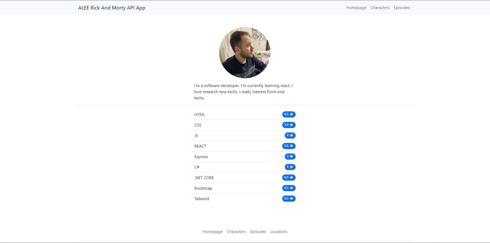
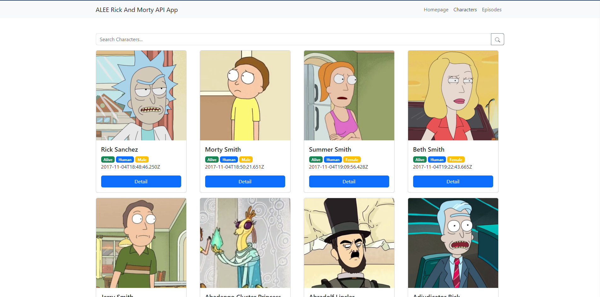
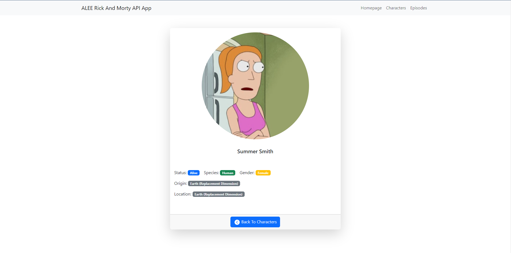
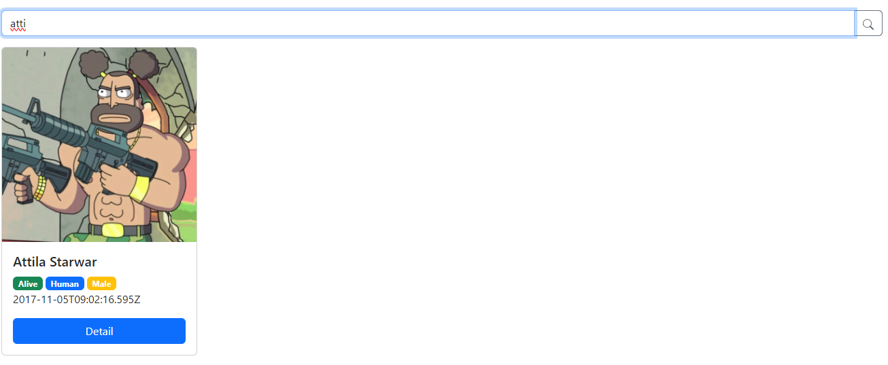
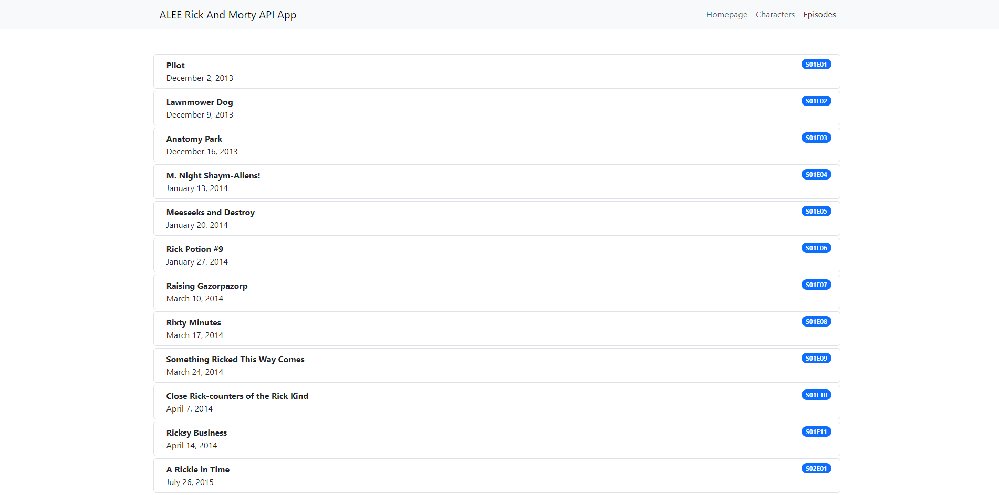

# Rick and Morty API ile React Uygulaması

Bu proje, Rick and Morty API'sini kullanarak geliştirilmiş bir React uygulamasını içerir. Uygulama, karakterlerin, bölümlerin ve konumların detaylarını gösteren bir dizi sayfadan oluşur.

## Proje Yapısı

Projede, aşağıdaki yapısal ögeler kullanılmıştır:

- `router`: Dış bir klasörden alınan router yapılandırması.
- `pages`: Sayfaların bulunduğu dizin.
- `components`: Bölümlere ayrılmış bileşenlerin tutulduğu dizin.

## Kullanılan Teknolojiler

Proje geliştirilirken aşağıdaki teknolojiler kullanılmıştır:

- React Hooks: `useEffect`, `useState`, `useParams` gibi.
- React Router: Yönlendirme işlemleri için.
- React Bootstrap: Kullanıcı arayüzü bileşenleri için.
- Axios: API istekleri için.
- Try-Catch Yapısı: Hata yönetimi için kullanılmıştır.

## Sayfalar ve Özellikler

- **Anasayfa (Homepage)**: Uygulama hakkında kısa bilgiler ve geliştirici hakkında bilgiler içerir.
- **Karakterler (Characters)**: Sonsuz sayfa ile karakter kartlarını görüntüler. Ayrıca arama çubuğu ile karakterleri filtreleme imkanı sunar.
- **Karakter Detayları (Characters:id)**: Karakterin detaylarını gösterir.
- **Bölümler (Episodes)**: Bölümleri gösterir. Sonsuz kaydırma yerine "Daha Fazla Yükle" düğmesi kullanılmıştır.

## Nasıl Çalıştırılır

1. Repoyu klonlayın: `git clone https://github.com/alifortacix/rick-and-morty-api-react.git`
2. Proje dizinine gidin: `cd proje`
3. Gerekli paketleri yükleyin: `npm install`
4. Projeyi başlatın: `npm start`

## Katkıda Bulunma

- Hataları raporlamak ve önerilerde bulunmak için [GitHub Issues](https://github.com/alifortacix/rick-and-morty-api-react.git/issues) kullanabilirsiniz.
- Kod geliştirmeleri için pull talepleri açabilirsiniz.

---

**Geliştirici:** [Ali Fortacı](https://github.com/alifortacix)

---

## Ekran Görüntüleri

# React Application with Rick and Morty API

This project includes a React application developed using the Rick and Morty API. The application consists of a series of pages that display details of characters, episodes, and locations.

## Project Structure

The project structure includes the following elements:

- `router`: Router configuration obtained from an external folder.
- `pages`: Directory containing the pages.
- `components`: Directory containing components divided into sections.

## Technologies Used

The project was developed using the following technologies:

- React Hooks: Utilized hooks such as `useEffect`, `useState`, `useParams`.
- React Router: Used for routing operations.
- React Bootstrap: Used for user interface components.
- Axios: Used for API requests.
- Try-Catch Structure: Implemented for error handling.

## Pages and Features

- **Homepage**: Provides brief information about the application and details about the developer.
- **Characters**: Displays character cards with infinite scrolling. Also provides the ability to filter characters using a search bar.
- **Character Details**: Shows details of a specific character.
- **Episodes**: Displays episodes. Utilizes a "Load More" button instead of infinite scrolling.

## How to Run

1. Clone the repository: `git clone https://github.com/alifortacix/rick-and-morty-api-react.git`
2. Navigate to the project directory: `cd project`
3. Install the required packages: `npm install`
4. Start the project: `npm start`

## Contribution

- You can report issues and provide suggestions using [GitHub Issues](https://github.com/alifortacix/rick-and-morty-api-react.git/issues).
- Pull requests are welcome for code improvements.

---

**Developer:** [Ali Fortacı](https://github.com/alifortacix)

---

## Screenshots

